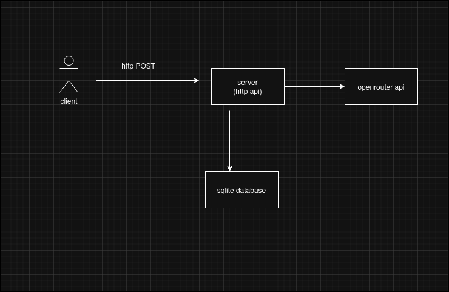

# Technical Report: Unix-Based Log Collection and Analysis System

**Student:** Ivan Orekhov  
**Course:** Computer Systems and Networks (CSN) + Unix Internet Applications (UIA)

---

## 1. Introduction

This report describes the design and implementation of a Unix-based client/server system for log collection and analysis. The system consists of a long-running HTTP server that receives and stores log messages, and a command-line client for sending logs. An external LLM service is integrated for automated log analysis.

### 1.1 Requirements

- Server: Long-running Unix process accepting logs over HTTP
- Client: Command-line tool for sending log messages
- Storage: Persistent log storage using SQLite
- LLM Integration: External service for log summarization and severity classification
- Error handling and basic configuration support

---

## 2. System Architecture

### 2.1 Technology Stack

- **Language:** Go 1.21
- **Protocol:** HTTP/REST
- **Database:** SQLite (modernc.org/sqlite - pure Go implementation)
- **LLM Service:** OpenRouter API (Arcee AI Trinity model)

### 2.2 Component Overview


### 2.3 Data Model

```go
type LogEntry struct {
    ID        int       `json:"id"`
    Timestamp time.Time `json:"timestamp"`
    Level     string    `json:"level"`     // info, warn, error
    Message   string    `json:"message"`
    Source    string    `json:"source"`    // hostname or identifier
}
```

---

## 3. Implementation Details

### 3.1 Server Implementation

The server is implemented as a single Go binary that runs as a long-lived process. It exposes two main HTTP endpoints:

**POST/GET /logs** - Log ingestion and retrieval
- Accepts JSON-formatted log entries
- Stores logs in SQLite with automatic timestamps
- Returns recent logs (last 100 entries) on GET requests

**POST /logs/analyze** - LLM-powered log analysis
- Fetches last 50 log entries
- Sends to OpenRouter API for analysis
- Returns structured analysis with severity classification

Key features:
- Graceful error handling with appropriate HTTP status codes
- Environment-based configuration (PORT, OPENROUTER_API_KEY)
- Automatic database schema initialization
- Connection pooling via Go's database/sql package

### 3.2 Client Implementation

The client is a command-line tool with flag-based arguments:

```bash
./client -message "Database connection failed" \
         -level error \
         -source "web-server-01" \
         -server http://localhost:8080
```

Features:
- Automatic hostname detection if source not specified
- JSON serialization of log entries
- HTTP POST to server endpoint
- Simple success/failure feedback

### 3.3 Storage Layer

SQLite was chosen for its simplicity and zero-configuration requirements:

```sql
CREATE TABLE logs (
    id INTEGER PRIMARY KEY AUTOINCREMENT,
    timestamp DATETIME,
    level TEXT,
    message TEXT,
    source TEXT
)
```

The pure Go SQLite driver (modernc.org/sqlite) eliminates CGO dependencies, making the binary fully portable across Unix systems.

### 3.4 LLM Integration

The LLM integration follows the requirement of using an external service only:

**Design Principles:**
- LLM does not implement core system logic
- Used only for analysis and insights
- System remains functional if LLM is unavailable
- API calls are isolated in `analyzeLogs()` function

**Implementation:**
```go
func analyzeLogs(logs string) string {
    // Construct prompt with log data
    // Call OpenRouter API
    // Parse and return analysis
}
```

The LLM provides:
1. Summary of log issues
2. Severity classification (low/medium/high)
3. Actionable recommendations

**Example Output:**
```
1) Summary of Issues:
- Application startup successful
- Performance degradation (high CPU usage)
- Critical database connectivity issue

2) Severity Classification:
- info: Application started - Low severity
- warn: High CPU usage - Medium severity
- error: Database connection failed - High severity

3) Recommendations:
- Monitor CPU usage trends
- Investigate database connection failure immediately
- Implement alert system for warnings
```

---

## 4. Error Handling and Configuration

### 4.1 Error Handling

- Database errors return HTTP 500 with error message
- Invalid JSON returns HTTP 400
- Missing LLM API key returns informative message
- Network timeouts (30s) for LLM API calls
- Graceful degradation if LLM service unavailable

### 4.2 Configuration

Environment variables:
- `PORT` - Server listening port (default: 8080)
- `OPENROUTER_API_KEY` - API key for LLM service

Database file: `./logs.db` (created automatically)

---

## 5. Testing and Usage

### 5.1 Build and Run

```bash
# Build binaries
go build -o server server.go
go build -o client client.go

# Start server
export OPENROUTER_API_KEY="sk-or-v1-..."
./server

# Send logs
./client -message "Application started" -level info
./client -message "High CPU usage" -level warn
./client -message "Database connection failed" -level error

# Query logs
curl http://localhost:8080/logs

# Analyze logs
curl -X POST http://localhost:8080/logs/analyze
```

### 5.2 Verification

The system was tested with:
- Multiple concurrent client connections
- Various log levels and message types
- LLM analysis with different log patterns
- Database persistence across server restarts

---

## 6. Conclusion

The implemented system satisfies all Part 1 requirements:

✓ Long-running Unix server process  
✓ Network-based log collection (HTTP)  
✓ Persistent storage (SQLite)  
✓ Command-line client  
✓ External LLM integration for analysis  
✓ Error handling and configuration  

The system provides a foundation for the extended distributed application required in Part 3, with clear separation between core functionality and LLM-assisted features.

### 6.1 Future Enhancements (Part 3)

- Concurrent client handling with goroutines
- Authentication and authorization
- Log rotation and retention policies
- Metrics and monitoring
- Graceful shutdown handling
- TLS/HTTPS support
- Rate limiting for LLM API calls

---

## References

- Go standard library documentation: https://pkg.go.dev/std
- SQLite documentation: https://www.sqlite.org/docs.html
- OpenRouter API: https://openrouter.ai/docs
- HTTP/REST best practices
